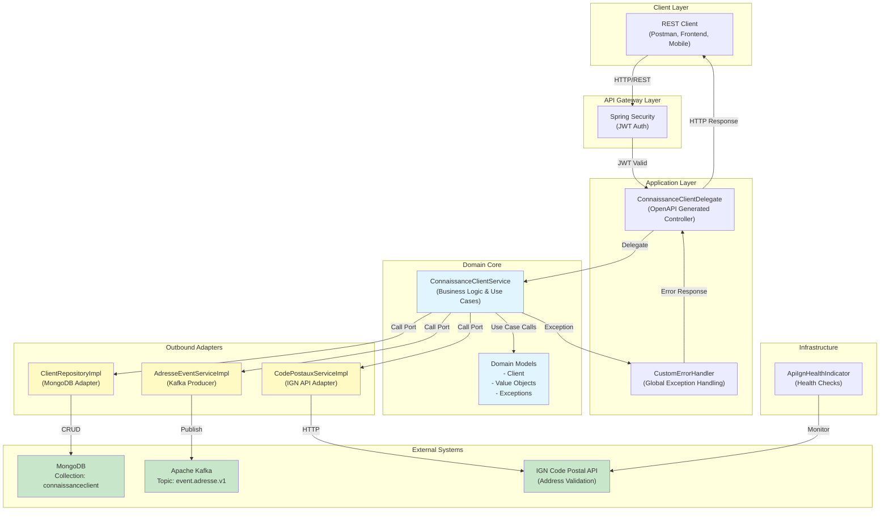
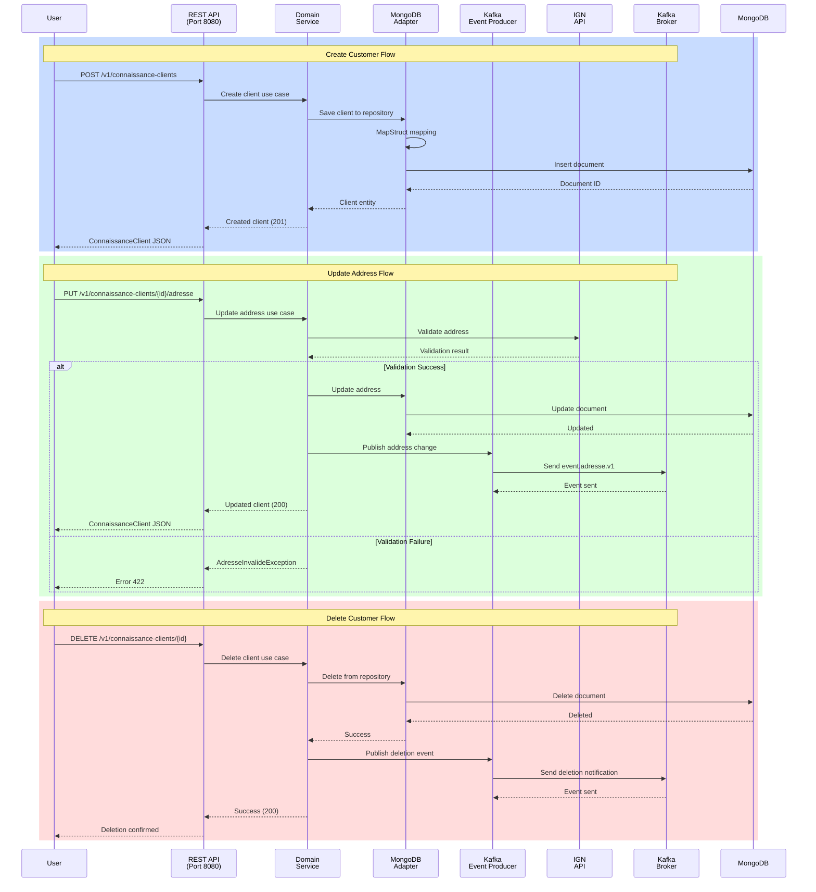
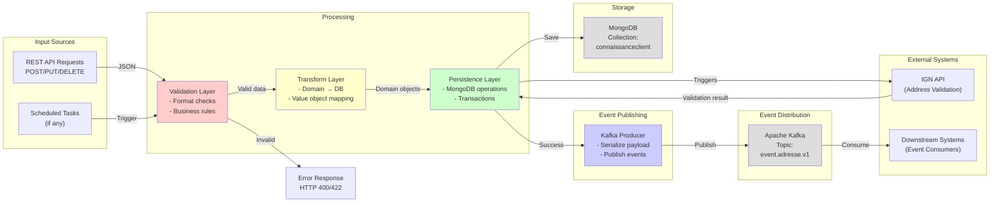

# Retrospective Specification: Connaissance Client API

**Project**: Connaissance Client  
**Version**: 2.2.0-SNAPSHOT  
**Java**: 21 | **Spring Boot**: 4.0.1  
**Date**: 2026-06-11  
**Author**: Technical & Functional Architect Analysis

---

## 1. Executive Summary

The **Connaissance Client** system is a Spring Boot microservice architecture built using **Hexagonal Architecture** (Ports & Adapters pattern) for managing comprehensive customer knowledge files. The system enables creation, consultation, modification, and deletion of customer profiles with complete address management and event-driven notifications.

### Key Characteristics
- **Architecture Pattern**: Hexagonal Architecture (Domain-driven design)
- **API Style**: RESTful (OpenAPI 3.0.1)
- **Event Pattern**: Event-driven with Kafka (AsyncAPI 3.0.0)
- **Database**: MongoDB
- **External Integration**: IGN Code Postal API
- **Deployment**: Docker containerized Spring Boot application

---

## 2. Functional Requirements

### 2.1 Core Features

#### 2.1.1 Customer Profile Management
- **Create Customer Profile**: Register new customer knowledge files with personal and family situation information
- **List All Profiles**: Retrieve complete list of customer profiles for display and export
- **View Profile Details**: Access specific customer profile by unique identifier
- **Delete Profile**: Permanently remove customer profile (GDPR compliance - right to be forgotten)
- **Manage Family Situation**: Track and update customer family status and number of children

#### 2.1.2 Address Management
- **Update Address**: Complete replacement of customer address information
- **Address Validation**: Validate addresses against IGN (French National Geographic Institute) API
- **Address Change Events**: Publish Kafka events on address modifications for downstream systems
- **Multi-line Address Support**: Support for optional secondary address line

#### 2.1.3 Data Integrity & Security
- **UUID-based Identification**: Unique identifiers for all customer profiles
- **Encrypted Personal Data**: Sensitive information encrypted at rest
- **JWT Authentication**: Bearer token-based API security
- **Audit Trail**: Automatic tracking of all operations for compliance
- **Cascading Deletion**: Related data automatically removed with profile deletion

---

## 3. Data Model

### 3.1 Core Entities

#### 3.1.1 Client (Customer)
```
Client
├── id: UUID (unique identifier)
├── nom: Nom (value object - surname)
├── prenom: Prenom (value object - first name)
├── adresse: Adresse (value object - address details)
├── situationFamiliale: SituationFamiliale (enum)
└── nombreEnfants: Integer (number of children)
```

#### 3.1.2 Adresse (Address)
```
Adresse
├── ligne1: LigneAdresse (required - primary address line)
├── ligne2: Optional<LigneAdresse> (optional - secondary line)
├── codePostal: CodePostal (required - postal code)
└── ville: Ville (required - city name)
```

#### 3.1.3 Value Objects (Domain Types)
- **Nom**: Immutable surname with validation rules (alphanumeric + special characters)
- **Prenom**: Immutable first name with validation rules
- **LigneAdresse**: Immutable address line (alphanumeric + special characters, 2-50 chars)
- **CodePostal**: Immutable postal code (5 digits, format: ^[A-Z0-9]+$)
- **Ville**: Immutable city name (alphanumeric + special characters, 2-50 chars)
- **Destinataire**: Immutable recipient name combining first and last names

#### 3.1.4 Enums
- **SituationFamiliale**: Enumeration of family statuses (values to be determined from domain analysis)

### 3.2 Persistence Model (MongoDB)
Document collection: `connaissanceclient`
```
{
  "_id": ObjectId (MongoDB ID),
  "id": String (UUID),
  "nom": String,
  "prenom": String,
  "ligne1": String,
  "ligne2": String (nullable),
  "codePostal": String,
  "ville": String,
  "situationFamiliale": String,
  "nombreEnfants": Integer
}
```

---

## 4. API Specification (OpenAPI 3.0.1)

### 4.1 Base Information
- **Title**: Connaissance Client API
- **Version**: 2.1.0
- **Format**: JSON (UTF-8 encoding)
- **Authentication**: JWT Bearer token required
- **Base URL**: `http://localhost:8080`

### 4.2 Endpoints

#### 4.2.1 List All Customers
```
GET /v1/connaissance-clients
Authentication: Required
Response: 200 (ConnaissanceClients[])
          400 Bad Request
          401 Unauthorized
          403 Forbidden
          409 Conflict
```
**Use Cases**: Display customer list for selection, export, global search
**Performance**: < 2 seconds (pagination recommended for large volumes)
**Cache**: Not active on list operations

#### 4.2.2 Create New Customer Profile
```
POST /v1/connaissance-clients
Authentication: Required
Content-Type: application/json
Request Body: ConnaissanceClientIn
Response: 201 Created (ConnaissanceClient)
          400 Bad Request
          401 Unauthorized
          403 Forbidden
          409 Conflict
```
**Use Cases**: Onboarding new customer, import from external system, manual entry
**Validation Rules**:
- All required fields must be provided
- Data format validation (email, postal code format, etc.)
- Family information consistency checks
- Single active profile per customer

**Business Rules**:
- Automatically generates UUID identifier
- Emits creation event for downstream notifications
- Encrypts personal information
- Validates address via IGN API

#### 4.2.3 Get Customer Profile Details
```
GET /v1/connaissance-clients/{id}
Authentication: Required
Path Parameter: id (UUID format)
Response: 200 OK (ConnaissanceClient)
          400 Bad Request
          404 Not Found
          401 Unauthorized
          403 Forbidden
```
**Use Cases**: View customer details, populate modification forms, pre-save verification, single customer export
**Performance**: < 100ms (5-minute cache on low-change data)
**Security**: 
- Authorized user access control
- On-the-fly decryption of sensitive data
- Automatic audit trail

#### 4.2.4 Update Customer Address (PUT)
```
PUT /v1/connaissance-clients/{id}/adresse
Authentication: Required
Path Parameter: id (UUID format)
Content-Type: application/json
Request Body: Adresse
Response: 200 OK (ConnaissanceClient)
          400 Bad Request
          404 Not Found
          422 Unprocessable Entity (validation failure)
          401 Unauthorized
          403 Forbidden
          500 Server Error
```
**Use Cases**: Customer relocation, address correction, address update after life event
**Validation**:
- Customer must exist
- Address validated via IGN API (postal code/city coherence)
- Returns 422 if external validation fails

**Behavior**:
- Only address modified (name, first name, situation unchanged)
- Kafka event published for address change notification
- Audit trail with complete traceability
- Circuit breaker for IGN API resilience (3 failures → skip 60s)
- Typical response time: < 2s (with IGN validation)

#### 4.2.5 Update Family Situation (PATCH)
```
PATCH /v1/connaissance-clients/{id}
Authentication: Required
Path Parameter: id (UUID format)
Content-Type: application/json
Request Body: Partial update fields
Response: 200 OK
          400 Bad Request
          404 Not Found
          401 Unauthorized
          403 Forbidden
```
**Use Cases**: Update family status, modify number of children
**REST Best Practice**: PATCH for partial modifications

#### 4.2.6 Delete Customer Profile
```
DELETE /v1/connaissance-clients/{id}
Authentication: Required
Path Parameter: id (UUID format)
Response: 200 OK
          400 Bad Request
          404 Not Found
          401 Unauthorized
          403 Forbidden
          500 Server Error
```
**⚠️ WARNING**: Irreversible operation

**Use Cases**: GDPR right to be forgotten, test/duplicate data cleanup, secure data archival
**Security Controls**:
- Deletion rights verification
- Mandatory audit trail with traceability
- Confirmation requirement for active accounts

**Impact**:
- Cascading deletion of related data
- Automatic notification to dependent systems
- Metadata archive for audit (without personal data)
- GDPR compliance with legal retention periods

---

## 5. Event-Driven Architecture (AsyncAPI 3.0.0)

### 5.1 Event Stream: Address Change Notifications
- **Protocol**: Apache Kafka
- **Topic**: `event.adresse.v1`
- **Version**: 1.0.0
- **Format**: JSON (application/json)
- **Environment**: Kafka broker at `localhost:9092` (development)

### 5.2 Message Structure

#### 5.2.1 Adresse Message Payload
```json
{
  "clientId": "UUID string",
  "adresse": {
    "destinataire": "First Name Last Name",
    "ligne1": "Street address (required)",
    "ligne2": "Optional secondary line",
    "codePostal": "33800",
    "ville": "Bordeaux"
  }
}
```

#### 5.2.2 Field Validation (AsyncAPI Schema)
- **ChaineAlpha**: Alphabetic string with spaces, commas, periods, apostrophes, hyphens (2-50 chars)
- **LigneAdresse**: Alphanumeric with special chars (2-50 chars)
- **CodePostal**: 5-character postal code format (^[A-Z0-9]+$)
- **Destinataire**: Combined recipient name (alphanumeric)

### 5.3 Operations
- **sendAdresseMessage**: Producer operation (send message on address change)
- **receiveAdresseMessage**: Consumer operation (receive address change events)
- **Kafka Binding**: GroupId configuration for consumer groups

### 5.4 Publishing Conditions
- Address modification via PUT `/v1/connaissance-clients/{id}/adresse`
- Successful validation and database commit
- Event includes complete updated address with client reference

---

## 6. Architecture Components

### 6.1 Architectural Pattern: Hexagonal Architecture (Ports & Adapters)

```
┌─────────────────────────────────────────────────────────────┐
│                    USER INTERFACE LAYER                      │
│              (API Controllers, REST Endpoints)               │
└────────────┬─────────────────────────────────────────────────┘
             │ HTTP/JSON
             ▼
┌─────────────────────────────────────────────────────────────┐
│                    APPLICATION LAYER                         │
│           (OpenAPI-generated Controllers/DTOs)              │
│                  ConnaissanceClientDelegate                 │
└────────────┬─────────────────────────────────────────────────┘
             │ Port Calls
             ▼
┌─────────────────────────────────────────────────────────────┐
│                    DOMAIN CORE (Ports)                       │
│         ConnaissanceClientService (Use Cases)               │
│              - Ports: Abstract interfaces                    │
│              - Models: Domain value objects                  │
│              - Rules: Business logic & validation            │
└────────────┬──────────┬───────────┬────────────┬─────────────┘
             │          │           │            │
      Port 1 │    Port 2 │     Port 3 │     Port 4 │
      Repo   │   Events  │   ExtAPI   │   Errors   │
             │          │           │            │
             ▼          ▼           ▼            ▼
┌──────────┐ │ ┌──────────┐ ┌──────────┐ ┌──────────┐
│   DB     │ │ │ Kafka    │ │ IGN API  │ │Exceptions│
│ Adapter  │ │ │ Adapter  │ │ Adapter  │ │ Handler  │
└──────────┘ │ └──────────┘ └──────────┘ └──────────┘
   (MongoDB) │ (Event-driven) (CodePostal) (Custom)
             │
    Outbound Adapters
```

### 6.2 Maven Modules

#### 6.2.1 `connaissance-client-domain`
**Purpose**: Core business logic and domain models
**Contents**:
- Domain models: `Client`, `Adresse`, value objects
- Service interface: `ConnaissanceClientService`
- Port interfaces: `ClientRepository`, `AdresseEventService`, `CodePostauxService`
- Exceptions: `ClientInconnuException`, `AdresseInvalideException`
- Enums: `SituationFamiliale`

**Dependencies**: Minimal (no Spring, no database)

#### 6.2.2 `connaissance-client-db-adapter`
**Purpose**: MongoDB persistence layer
**Contents**:
- `ClientDb`: MongoDB document entity
- `ClientRepositoryImpl`: Repository implementation (port adapter)
- `ClientDbMapper`: MapStruct mapper (domain ↔ database)
- `ClientDbRepository`: Spring Data MongoDB interface

**Technology**: Spring Data MongoDB, MapStruct
**Collection**: `connaissanceclient`

#### 6.2.3 `connaissance-client-event-adapter`
**Purpose**: Kafka event publishing for address changes
**Contents**:
- `AdresseEventServiceImpl`: Event service implementation
- Message mapping to AsyncAPI schemas
- Kafka producer configuration

**Technology**: Spring Kafka, AsyncAPI generator
**Topic**: `event.adresse.v1`

#### 6.2.4 `connaissance-client-cp-adapter`
**Purpose**: Integration with external Code Postal (IGN) service
**Contents**:
- `CodePostauxServiceImpl`: External service adapter
- Address validation against IGN API
- Circuit breaker for resilience
- Error handling for external service failures

**Technology**: Resilience4j, HTTP client
**External API**: IGN Code Postal validation service

#### 6.2.5 `connaissance-client-api`
**Purpose**: API contract and code generation
**Contents**:
- `connaissance-client-api.yaml`: OpenAPI specification
- Generated controllers (OpenAPI Generator Maven plugin)
- Generated DTOs: `ConnaissanceClient`, `ConnaissanceClientIn`, etc.
- `ConnaissanceClientDelegate`: Implementation interface

**Technology**: OpenAPI Generator 7.18.0, Swagger annotations
**Generation**: Maven generate-sources phase

#### 6.2.6 `connaissance-client-app`
**Purpose**: Spring Boot application assembly
**Contents**:
- `ConnaissanceClientApplication`: Spring Boot main class
- Configuration classes: `DatabaseConfiguration`, `SecurityConfig`, `OpenApiConfig`
- `CustomErrorHandler`: Global exception handling
- `ApiIgnHealthIndicator`: Health check for IGN API
- Application properties for all environments

**Technology**: Spring Boot 4.0.1, Spring Security
**Profiles**: dev, workshop, prod

---

## 7. External Integration Points

### 7.1 IGN Code Postal API
**Purpose**: Address validation and postal code verification
**When Used**: During address creation and modification
**Resilience**: Circuit breaker pattern
- Threshold: 3 failures
- Timeout: 60 seconds (skip validation during circuit break)

**Error Handling**: Returns HTTP 422 if validation fails

### 7.2 MongoDB Database
**Connection**: Spring Data MongoDB
**Collection**: `connaissanceclient`
**Features**:
- Automatic mapping via MapStruct
- Index optimization required (customer queries)
- Encryption at rest for personal data

### 7.3 Kafka Message Broker
**Topic**: `event.adresse.v1`
**Consumer Groups**: Configurable via AsyncAPI bindings
**Message Format**: JSON (AsyncAPI schema)
**Use**: Address change notifications to dependent systems

---

## 8. Security & Compliance

### 8.1 Authentication
- **Method**: JWT Bearer tokens
- **Validation**: Applied to all endpoints
- **Configuration**: `SecurityConfig` class

### 8.2 Data Protection
- **Personal Data Encryption**: Implemented at application layer
- **GDPR Compliance**: Right to be forgotten via DELETE endpoint
- **Audit Trail**: Automatic logging of all operations

### 8.3 Cascading Operations
- Profile deletion removes all related records
- Notifications sent to dependent systems
- Archive metadata maintained for audit compliance

---

## 9. Error Handling & Validation

### 9.1 Custom Exceptions
- **ClientInconnuException**: Customer profile not found
- **AdresseInvalideException**: Address validation failure

### 9.2 HTTP Status Responses
- **200**: Successful operation
- **201**: Resource created
- **400**: Invalid request (malformed data)
- **401**: Unauthorized (missing/invalid authentication)
- **403**: Forbidden (insufficient permissions)
- **404**: Resource not found
- **409**: Conflict (data consistency violation)
- **422**: Unprocessable entity (validation failure)
- **500**: Server error (unexpected failure)

### 9.3 Error Response Format
```json
{
  "error": "Error message",
  "code": "ERROR_CODE",
  "timestamp": "ISO-8601 timestamp",
  "path": "/v1/endpoint"
}
```

---

## 10. Non-Functional Requirements

### 10.1 Performance
- **List customers**: < 2 seconds (recommend pagination for large volumes)
- **Get customer details**: < 100ms (5-minute cache)
- **Update address**: < 2 seconds (includes IGN validation)
- **Database queries**: Indexed for optimal performance

### 10.2 Scalability
- **Stateless API design**: Horizontal scaling capability
- **Event-driven**: Asynchronous processing for address notifications
- **Circuit breaker**: Prevents cascade failures from external APIs

### 10.3 Reliability
- **Resilience4j**: Circuit breaker, retry logic for external APIs
- **Automated health checks**: IGN API availability monitoring
- **Graceful degradation**: Skip external validation if service unavailable

### 10.4 Observability
- **Logging**: SLF4j logging throughout (configured per environment)
- **Metrics**: Spring Boot actuator (if enabled)
- **Health checks**: `/health` endpoint with IGN API indicator

### 10.5 Deployment
- **Container**: Docker image with Java 21 runtime
- **Environment**: Spring profiles (dev, workshop, prod)
- **Orchestration**: Kubernetes support via YAML files in env-tests/k8s/

---

## 11. Technology Stack Summary

| Layer | Technology | Version |
|-------|-----------|---------|
| **Runtime** | Java | 21 LTS |
| **Framework** | Spring Boot | 4.0.1 |
| **API** | OpenAPI | 3.0.1 |
| **Events** | AsyncAPI / Kafka | 3.0.0 |
| **Database** | MongoDB | Latest |
| **Mapping** | MapStruct | 1.6.3 |
| **Validation** | Hibernate Validation | 8.0.0 |
| **Resilience** | Resilience4j | 2.2.0 |
| **Logging** | SLF4j | Latest |
| **Build** | Maven | 3.x |
| **Container** | Docker | Latest |

---

## 12. Build & Deployment Commands

### 12.1 Compilation
```bash
./mvnw clean install -DskipTests=false
```

### 12.2 Development Execution
```bash
./mvnw -pl connaissance-client-app -am spring-boot:run
```

### 12.3 Package JAR
```bash
./mvnw -DskipTests package -pl connaissance-client-app -am
```

### 12.4 Docker Build
```bash
docker build -t connaissance-client:local .
docker run --rm -p 8080:8080 connaissance-client:local
```

### 12.5 OpenAPI Code Generation
```bash
./mvnw -pl connaissance-client-api -am generate-sources
```

---

## 13. Key Design Patterns

### 13.1 Hexagonal Architecture (Ports & Adapters)
- **Core benefit**: Domain logic isolated from infrastructure
- **Implementation**: Clear separation of concerns across modules
- **Maintainability**: Easy to test, extend, and modify

### 13.2 Domain-Driven Design
- **Value Objects**: Immutable types (Nom, Prenom, Adresse, etc.)
- **Aggregate Root**: Client is the primary aggregate
- **Ubiquitous Language**: Domain concepts reflected in code

### 13.3 Event-Driven Architecture
- **Decoupling**: Address changes published as Kafka events
- **Scalability**: Asynchronous processing of notifications
- **Traceability**: Event sourcing potential for audit trails

### 13.4 Circuit Breaker Pattern
- **IGN API resilience**: Prevents cascade failures
- **Failure threshold**: 3 failures before opening circuit
- **Recovery time**: 60-second timeout before retry

### 13.5 Repository Pattern
- **Abstraction**: Database operations encapsulated
- **Testability**: Easy to mock for unit tests
- **Flexibility**: Swap implementations without affecting domain

---

## 14. Known Issues & Considerations

### 14.1 [NEEDS CLARIFICATION] Family Situation Enum Values
**Context**: `SituationFamiliale` enum is defined but specific values not documented
**Question**: What are the valid family status values (Married, Single, Divorced, etc.)?
**Impact**: Customer profile completeness and business logic validation

### 14.2 [NEEDS CLARIFICATION] IGN API Error Handling Strategy
**Context**: Circuit breaker skips validation after 3 failures (60s timeout)
**Question**: Should system:
- A) Accept addresses during circuit-break (reduced validation)?
- B) Reject all addresses during circuit-break (strict mode)?
- C) Queue for deferred validation?

**Impact**: Data quality vs. availability trade-off

### 14.3 [NEEDS CLARIFICATION] Encryption Implementation Details
**Context**: Personal data encryption mentioned in specs but implementation not visible
**Question**: 
- Is encryption at database level (MongoDB field-level encryption)?
- Is it at application level (before storage)?
- What key management strategy is used?

**Impact**: Security posture and audit trail requirements

---

## 15. Architecture Diagram (Mermaid)



---

## 16. Component Interaction Diagram



---

## 17. Data Flow Diagram



---

## 18. Dependencies & Module Structure

```
connaissance-client (ROOT POM)
│
├── connaissance-client-domain
│   ├── Models (Client, Adresse, Value Objects)
│   ├── Services (ConnaissanceClientService interface)
│   ├── Ports (ClientRepository, AdresseEventService, CodePostauxService)
│   └── Exceptions
│
├── connaissance-client-db-adapter
│   ├── Depends on: connaissance-client-domain
│   ├── ClientDb (MongoDB entity)
│   ├── ClientRepositoryImpl (implements ClientRepository port)
│   └── ClientDbMapper (MapStruct)
│
├── connaissance-client-event-adapter
│   ├── Depends on: connaissance-client-domain
│   ├── AdresseEventServiceImpl (implements AdresseEventService port)
│   └── Generated event models (AsyncAPI)
│
├── connaissance-client-cp-adapter
│   ├── Depends on: connaissance-client-domain
│   └── CodePostauxServiceImpl (implements CodePostauxService port)
│
├── connaissance-client-api
│   ├── Depends on: connaissance-client-domain
│   ├── OpenAPI specification (YAML)
│   ├── Generated controllers & DTOs
│   └── ConnaissanceClientDelegate interface
│
└── connaissance-client-app
    ├── Depends on: All above modules
    ├── Spring Boot application
    ├── Configuration classes
    ├── Application properties (dev, workshop, prod)
    └── Main entry point
```

---

## 19. Testing Strategy

### 19.1 Unit Tests
- **Domain Models**: Value object validation, business logic
- **Services**: Use case scenarios, exception handling
- **Mappers**: Domain ↔ Database transformation

### 19.2 Integration Tests
- **Database**: Repository operations with MongoDB
- **Events**: Kafka message publishing and format
- **External APIs**: IGN API integration with mocking

### 19.3 E2E Tests
- **Docker Compose**: Complete stack testing (app, MongoDB, Kafka, services)
- **JMeter**: Performance testing (env-tests/jmeter/)

### 19.4 Health Checks
- **Liveness**: Application startup verification
- **Readiness**: Service dependencies availability
- **Custom**: IGN API health indicator

---

## 20. Configuration & Environments

### 20.1 Development (Dev)
- **Database**: Local MongoDB (Docker)
- **Events**: Local Kafka (Docker)
- **Logging**: DEBUG level
- **External APIs**: Mocked or sandboxed

### 20.2 Workshop
- **Database**: Containerized MongoDB
- **Events**: Containerized Kafka
- **Logging**: INFO level
- **Profile**: `application-workshop.yml`

### 20.3 Production
- **Database**: Managed MongoDB cluster
- **Events**: Production Kafka cluster
- **Logging**: WARN level
- **Security**: TLS/SSL, certificate management
- **Profile**: `application-prod.yml`

---

## 21. Assumptions & Constraints

### 21.1 Assumptions
1. **JWT Authentication**: Assumes secure token generation and validation elsewhere
2. **MongoDB Availability**: System assumes MongoDB is always available (no offline mode)
3. **Kafka Delivery**: Events are delivered to Kafka at-least-once (not exactly-once)
4. **IGN API Availability**: Fallback to circuit-breaker skips validation, doesn't reject
5. **Personal Data Encryption**: Implemented at application layer (not database)
6. **Unique Customer Per Profile**: Only one active profile per customer

### 21.2 Constraints
1. **Java 21**: Project requires Java 21 (LTS) or higher
2. **MongoDB Collection Name**: Fixed to `connaissanceclient`
3. **Kafka Topic**: Fixed to `event.adresse.v1` for address changes
4. **REST API**: Versioning via `/v1/` path prefix
5. **UUID Identifiers**: All customers use UUID (not sequential IDs)

---

## 22. Success Criteria (Retrospective)

### 22.1 Architecture Quality
- ✅ Clear separation of concerns (Domain, Adapters, Application)
- ✅ Testable domain logic (no Spring/database dependencies)
- ✅ Flexible component composition (easy to mock/replace)
- ✅ SOLID principles adherence

### 22.2 API Compliance
- ✅ OpenAPI 3.0.1 specification complete and accurate
- ✅ All endpoints RESTful and idempotent where applicable
- ✅ Proper HTTP status codes and error responses
- ✅ Security implemented (JWT authentication)

### 22.3 Event Handling
- ✅ AsyncAPI 3.0.0 specification for Kafka topics
- ✅ Events published on all relevant operations
- ✅ Message schema validation implemented

### 22.4 External Integration
- ✅ IGN API integration with circuit breaker
- ✅ Health checks for external dependencies
- ✅ Graceful degradation on API failures

### 22.5 Data Persistence
- ✅ MongoDB integration via Spring Data
- ✅ Mapping layer (MapStruct) for domain ↔ database
- ✅ Index optimization for queries

### 22.6 Operational Readiness
- ✅ Docker containerization
- ✅ Multiple environment configurations
- ✅ Logging and health indicators
- ✅ Build automation with Maven

---

## 23. Change Log

| Version | Date | Changes |
|---------|------|---------|
| 2.2.0 | Current | Current state retrospective specification |
| 2.1.0 | Previous | Added PATCH endpoints for partial modifications |
| 2.0.0 | Earlier | Initial API version |

---

## 24. Recommendations for Next Steps

### 24.1 Immediate Actions (Validation Phase)
- [ ] Review clarification questions (Section 14) with stakeholders
- [ ] Validate family situation enum values
- [ ] Confirm IGN API circuit-breaker strategy
- [ ] Clarify encryption implementation approach

### 24.2 Short-term Improvements
- [ ] Add API rate limiting
- [ ] Implement request/response logging
- [ ] Add customer search/filtering endpoints
- [ ] Create batch operations (bulk import/export)
- [ ] Document SLA and availability targets

### 24.3 Long-term Evolution
- [ ] Implement event sourcing for complete audit trail
- [ ] Add GraphQL endpoint alongside REST API
- [ ] Migrate to microservices if domain complexity grows
- [ ] Implement API versioning strategy (v2, v3, etc.)
- [ ] Add analytics and business intelligence features

---

## 25. Appendix: File Structure

```
connaissance-client/
├── .github/
│   ├── copilot-instructions.md
│   └── prompts/
├── .specify/
│   ├── extensions.yml
│   ├── init-options.json
│   ├── feature.json
│   └── extensions/
├── connaissance-client-domain/
│   ├── pom.xml
│   └── src/main/java/.../
│       ├── models/          (Client, Adresse, types)
│       ├── ports/           (Repository, EventService)
│       ├── enums/           (SituationFamiliale)
│       ├── exceptions/      (ClientInconnuException)
│       └── ConnaissanceClientService.java
├── connaissance-client-db-adapter/
│   ├── pom.xml
│   └── src/main/java/.../
│       ├── ClientDb.java
│       ├── ClientRepositoryImpl.java
│       └── ClientDbMapper.java
├── connaissance-client-event-adapter/
│   ├── pom.xml
│   └── src/main/java/.../
│       └── AdresseEventServiceImpl.java
├── connaissance-client-cp-adapter/
│   ├── pom.xml
│   ├── src/main/resources/code-postaux-api.yaml
│   └── src/main/java/.../
│       └── CodePostauxServiceImpl.java
├── connaissance-client-api/
│   ├── pom.xml
│   ├── src/main/resources/
│   │   └── connaissance-client-api.yaml
│   └── src/main/java/.../
│       └── ConnaissanceClientDelegate.java
├── connaissance-client-app/
│   ├── pom.xml
│   ├── src/main/java/.../
│   │   ├── ConnaissanceClientApplication.java
│   │   ├── config/          (Database, Security, OpenAPI)
│   │   └── health/          (Indicators)
│   └── src/main/resources/
│       ├── application.yml
│       ├── application-dev.yml
│       ├── application-workshop.yml
│       └── application-prod.yml
├── env-tests/
│   ├── docker/
│   │   ├── docker-compose.yml
│   │   └── start.sh, stop.sh
│   ├── k8s/                 (Kubernetes manifests)
│   └── jmeter/              (Performance tests)
├── pom.xml                  (Root POM)
├── Dockerfile
├── README.md
└── .gitignore
```

---

## Document Information
- **Document Type**: Retrospective Specification (Reverse Engineering)
- **Generated**: 2026-06-11
- **Analysis Scope**: Complete codebase examination
- **Based On**: OpenAPI 3.0.1, AsyncAPI 3.0.0, Domain Models, Maven POM structure
- **Status**: Ready for Stakeholder Validation

---
